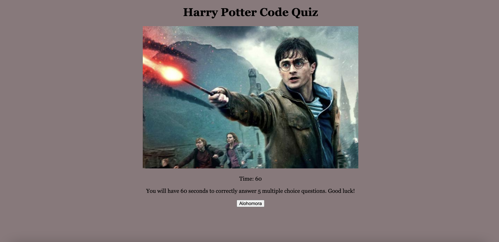

# Code Quiz
## Description
- My motivation for this project was to create a code game for a Harry Potter fan.
- I built this project to challenge me on javascript and to increase my experience with html and css.
- I learned how to create a countdown and string of questions.
## Installation
- Create a uniquely named repository on GitHub.
- Worked locally through my terminal to create my code quiz functions and styling.
## Usage
Simply click the correct anwser to add ten points to your score. If you choose the wrong answer, your time will be reduced by ten seconds. Add your initials to track the highest score.
    ```md
    
    ```
## Credits
Faran Navazi, my tutor.